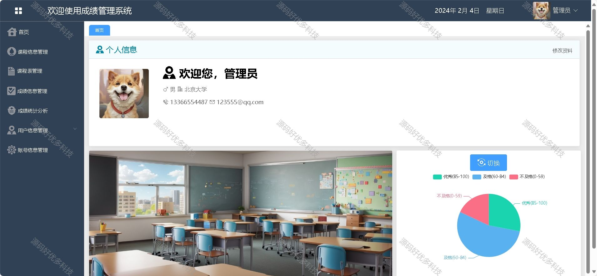
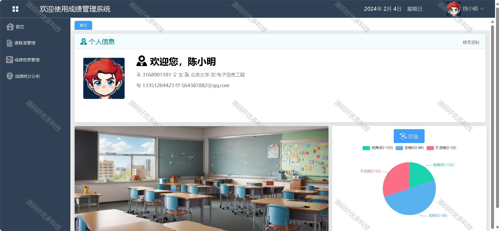

### 一、作品包含

源码+数据库+设计文档+全套环境和工具资源+部署教程

### 二、项目技术

前端技术：Html、Css、Js、Vue、Element-ui

数据库：MySQL

后端技术：Java、Spring Boot、MyBatis

### 三、运行环境

开发工具：IDEA/eclipse

数据库：MySQL8.0

数据库管理工具：Navicat10以上版本

环境配置软件： JDK1.8+Maven3.6.3

前端Nodejs：16

### 四、项目介绍

项目编号：springbootA008
随着我国高等教育的发展，数字化校园将成为必然趋势，国内高校迫切需要提高教育工作的质量和效率，学生绩效管理是高校信息化管理的重要组成部分使,本系统管理者从繁琐的日常工作中解放出来，提高了工作效率，实现了信息共享
①管理员：登录、成绩查询、成绩录入、导出、编辑成绩、用不同的图状呈现成绩详情、课程录入、编辑删除课程、学生管理、教师管理、账号管理、修改密码等。
②教师：登录、课程表、录入修改成绩、导出成绩、查看成绩详情、修改密码等。
③学生：登录、查看课程表、查询成绩、显示成绩详情。

### 五、运行截图

